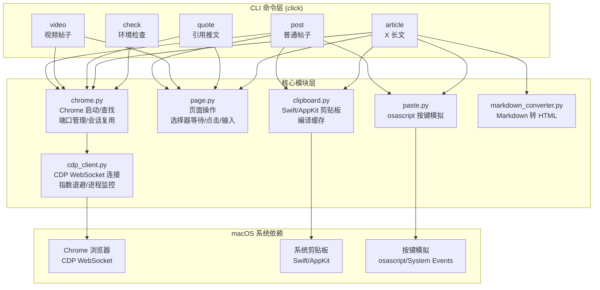

## 用户需求

开发一个基于真实 Chrome 浏览器 + CDP（Chrome DevTools Protocol）的 X（Twitter）发帖 CLI 工具，仅支持 macOS 平台，使用 Python 语言开发。

## 产品概述

一个独立的 Python CLI 命令行工具，通过连接真实 Chrome 浏览器实例（非 Puppeteer/Playwright），利用 CDP 协议操控页面元素，配合 macOS 系统级剪贴板（Swift/AppKit）和按键模拟（osascript），绕过 X 平台的反自动化检测机制。默认仅预览（填充内容到浏览器），用户确认后才实际发布。重点改进旧项目中 Chrome 调试端口连接不稳定的问题。

## 核心功能

1. **普通帖子（文本 + 图片）**：支持纯文本发帖，可附带最多 4 张图片。通过 CDP 打开 X 编辑器页面输入文本，通过系统剪贴板 + osascript 真实按键粘贴上传图片
2. **视频帖子（文本 + 视频）**：支持上传 MP4/MOV/WebM 视频文件发帖，通过 CDP 的 `DOM.setFileInputFiles` 设置文件输入，自动等待视频处理完成
3. **引用推文（Quote Tweet）**：打开目标推文页面，通过 CDP 点击转推按钮，选择引用选项，在编辑框中输入评论
4. **X 长文（Article）**：支持将 Markdown 文件转换为 HTML 并发布为 X 长文，包含封面图上传、标题填写、富文本内容粘贴、内嵌图片占位符替换
5. **环境检查**：检测 Chrome 安装、macOS Accessibility 权限、剪贴板能力等

## 技术栈

- **语言**：Python 3.9+
- **运行时**：系统 Python / uv（无需额外运行时如 Bun）
- **浏览器控制**：Chrome DevTools Protocol（原生 WebSocket，通过 `websockets` 库）
- **CLI 框架**：`click`（参数解析、帮助文档、子命令管理）
- **Markdown 处理**：`markdown` + `Pygments`（代码高亮）+ `pyyaml`（frontmatter 解析）
- **剪贴板操作**：macOS Swift/AppKit 编译缓存（与旧项目相同原理，Python 调用）
- **按键模拟**：macOS `osascript` + System Events
- **HTTP 请求**：`httpx`（异步，用于 CDP 端口探测和图片下载）
- **异步框架**：`asyncio`（CDP 通信全异步）

## 实现方案

### 整体策略

使用 Python 从零构建独立 CLI 工具。核心理念与旧 TypeScript 项目一致（真实 Chrome + CDP + 系统级粘贴），但重点解决旧项目的 Chrome 调试端口连接问题，改用 Python asyncio 实现更健壮的异步 CDP 通信。

### 关键改进（解决旧项目 "Chrome debug port not ready" 问题）

旧项目 `waitForChromeDebugPort` 的问题分析：

1. **端口分配竞态**：`getFreePort()` 获取端口后释放，Chrome 启动前该端口可能被占用
2. **固定轮询间隔**：200ms 固定间隔，无退避策略，可能在 Chrome 启动慢时超时
3. **无进程健康检查**：Chrome 如果启动失败或 crash，代码仍在无限轮询端口
4. **DevToolsActivePort 文件残留**：上次 Chrome 异常退出后的残留文件导致端口误判

改进方案：

- **端口锁定**：获取端口后不立即释放，保持 socket 占用直到 Chrome 参数构造完成，避免竞态
- **指数退避重试**：100ms -> 200ms -> 400ms -> 800ms -> 1600ms，最长单次间隔 3s，总超时 30s
- **进程存活监控**：Chrome 启动后持续检查 `proc.poll()` 返回值，若进程退出立即抛出异常并附带 stderr
- **启动前清理**：自动清理 profileDir 下残留的 `DevToolsActivePort` 文件
- **双重验证**：先 HTTP 探测 `/json/version`，再 WebSocket 握手，两步都成功才认为连接就绪
- **已有实例检测**：优先尝试连接已有 Chrome CDP 实例，避免重复启动

### 反自动化检测策略

- `--disable-blink-features=AutomationControlled` 移除 `navigator.webdriver` 标记
- 独立 `--user-data-dir` 持久化登录会话
- 图片上传通过系统剪贴板 + osascript 真实按键，而非 CDP 合成事件
- 不使用 Puppeteer/Playwright 等会注入特征的框架
- 原生 WebSocket CDP 通信，无第三方 CDP 库指纹

### 关键技术决策

1. **Python 而非 TypeScript**：用户明确要求。Python 的 `asyncio` + `websockets` 提供了更清晰的异步 CDP 通信模型
2. **`websockets` 而非 `websocket-client`**：原生 asyncio 支持，与 CDP 的事件驱动模型匹配
3. **`click` CLI 框架**：比 argparse 更简洁，自动生成帮助文档，子命令支持好
4. **Swift 编译缓存复用**：与旧项目相同策略，但缓存路径改为 `~/.cache/x-skill/clipboard/`
5. **仅 macOS**：去除所有 Linux/Windows 分支，代码更简洁

## 实现注意事项

- **Chrome 实例冲突**：启动前检测 `pgrep -f "Chrome.*remote-debugging-port"`，存在时提示用户或自动复用
- **图片粘贴验证**：粘贴后轮询 `img[src^="blob:"]` 数量验证成功，超时 15 秒
- **视频处理等待**：视频上传后轮询 tweetButton 可点击状态，最长等待 180 秒
- **DraftJS 编辑器兼容**：X 长文内容插入使用 ClipboardEvent paste 事件模拟，失败回退到 `execCommand('insertHTML')`
- **预览模式为默认**：所有命令默认只填充内容不发布，需 `--submit` 参数
- **进程清理**：使用 `atexit` 和信号处理确保 Chrome 进程在脚本异常退出时被清理

## 架构设计

### 系统架构



### 数据流

1. CLI 解析参数 -> `chrome.launch()` 启动 Chrome 并通过 `cdp_client` 建立 CDP 连接
2. `cdp_client` 通过 `Target.getTargets` / `Target.attachToTarget` 获取页面会话
3. `page.py` 通过 `Runtime.evaluate` 操作 DOM（等待选择器、点击、输入文本）
4. 图片上传：`clipboard.py` 通过 Swift 写入系统剪贴板 -> `paste.py` 通过 osascript 发送 Cmd+V
5. 视频上传：`DOM.setFileInputFiles` 直接设置文件输入
6. 长文内容：`markdown_converter.py` 转换 Markdown -> 通过 ClipboardEvent paste 粘贴 HTML

### 模块划分

| 模块 | 职责 |
| --- | --- |
| `cli.py` | click 主入口，注册 post/video/quote/article/check 子命令 |
| `cdp_client.py` | CDP WebSocket 连接封装（异步消息收发、事件监听、超时管理、自动重连） |
| `chrome.py` | macOS Chrome 查找/启动、端口分配（锁定策略）、进程生命周期管理、实例复用 |
| `page.py` | 页面 DOM 操作：选择器等待、点击、文本输入、文件上传、JavaScript 执行 |
| `clipboard.py` | macOS 剪贴板写入（Swift/AppKit 编译缓存，支持图片和 HTML/RTF） |
| `paste.py` | macOS osascript 真实按键模拟（Cmd+V，支持指定目标 App） |
| `markdown_converter.py` | Markdown 转 HTML：YAML frontmatter 解析、代码高亮、图片占位符 |
| `commands/post.py` | 普通帖子命令实现 |
| `commands/video.py` | 视频帖子命令实现 |
| `commands/quote.py` | 引用推文命令实现 |
| `commands/article.py` | X 长文命令实现 |
| `commands/check.py` | 环境检查命令实现 |


## 目录结构

```
x-skill/
├── pyproject.toml              # [NEW] Python 项目配置。定义项目元数据、依赖（click, websockets, httpx, markdown, pygments, pyyaml）、入口点 [project.scripts] x-post = "x_poster.cli:main"，Python >= 3.9
├── README.md                   # [NEW] 项目说明文档。功能介绍、安装方式（pip install -e . 或 uv pip install -e .）、使用示例、环境要求、故障排查
├── src/
│   └── x_poster/
│       ├── __init__.py         # [NEW] 包初始化。版本号定义
│       ├── cli.py              # [NEW] CLI 主入口。使用 click.group 注册 post/video/quote/article/check 五个子命令，全局选项 --profile（Chrome profile 目录）、--chrome-path（Chrome 可执行文件路径）
│       ├── cdp_client.py       # [NEW] CDP WebSocket 客户端。CdpClient 类：asyncio + websockets 实现异步消息收发，pending 请求 Map（id -> Future），事件回调注册，超时管理（默认 15s），连接关闭时自动 reject 所有 pending。核心方法：connect(ws_url), send(method, params, session_id, timeout), on(event, callback), close()
│       ├── chrome.py           # [NEW] Chrome 生命周期管理。ChromeManager 类：find_chrome()（macOS 路径候选列表 + 环境变量覆盖）、get_free_port()（端口锁定策略：获取后保持 socket 直到 Chrome 启动）、launch(url, profile_dir)（启动 Chrome + 指数退避探测 /json/version + WebSocket 握手双重验证 + 进程存活监控）、cleanup()（Browser.close + SIGTERM + SIGKILL）。启动前自动清理残留 DevToolsActivePort 文件。支持复用已有 Chrome 实例
│       ├── page.py             # [NEW] 页面操作辅助。PageHelper 类：wait_for_selector(selector, timeout)、wait_for_any_selector(selectors, timeout)、click_selector(selector)、evaluate(expression)、type_text(selector, text)（通过 execCommand insertText）、upload_file(selector, file_path)（DOM.setFileInputFiles）
│       ├── clipboard.py        # [NEW] macOS 剪贴板操作。内嵌 Swift/AppKit 源码字符串，首次调用编译为二进制缓存至 ~/.cache/x-skill/clipboard/（MD5 哈希校验）。copy_image(path)、copy_html(html_content_or_path) 两个主函数
│       ├── paste.py            # [NEW] macOS 按键模拟。send_paste(target_app, retries, delay) 函数：通过 osascript 发送 Cmd+V（可选先激活目标 App），支持重试和延迟
│       ├── markdown_converter.py # [NEW] Markdown 转 HTML 转换器。parse_markdown(md_path, title_override, cover_override) 函数：YAML frontmatter 解析（title/cover_image）、markdown 库自定义扩展（H1 作标题跳过、H2-H6 统一为 h2、代码块转 blockquote + Pygments 高亮）、图片替换为 XIMGPH_N 占位符、远程图片下载缓存。返回 ParsedArticle dataclass
│       └── commands/
│           ├── __init__.py     # [NEW] 子命令包初始化
│           ├── post.py         # [NEW] 普通帖子命令。打开 x.com/compose/post，等待编辑器加载，execCommand 输入文本，逐张图片通过 clipboard+paste 上传并验证。参数：text, --image（可重复, 最多4张）, --submit, --profile
│           ├── video.py        # [NEW] 视频帖子命令。打开 x.com/compose/post，DOM.setFileInputFiles 上传视频，等待处理完成（轮询 tweetButton 可点击, 最长 180s），输入文本。参数：text, --video, --submit, --profile
│           ├── quote.py        # [NEW] 引用推文命令。打开目标推文，点击 retweet 按钮，从下拉菜单选择引用选项（多语言文本匹配），输入评论。参数：tweet_url, comment, --submit, --profile
│           ├── article.py      # [NEW] X 长文命令。解析 Markdown，打开 x.com/compose/articles，上传封面图、填写标题、粘贴 HTML 内容、替换图片占位符。参数：markdown_path, --cover, --title, --submit, --profile
│           └── check.py        # [NEW] 环境检查命令。依次检测 Chrome 安装、Profile 目录、Accessibility 权限、剪贴板能力、粘贴按键能力、Chrome 实例冲突。输出格式化检查结果
```

## Agent Extensions

### Skill

- **skill-creator**
- Purpose：项目完成后如果需要创建 SKILL.md 或文档时参考最佳实践
- Expected outcome：确保 README.md 和项目文档质量符合规范

### SubAgent

- **code-explorer**
- Purpose：在实现过程中查阅旧项目 `baoyu-post-to-x` 的代码细节（如 X 页面选择器、DraftJS 编辑器交互等），确保新 Python 实现覆盖所有边界情况
- Expected outcome：获取旧项目中特定 DOM 选择器、CDP 调用细节等实现信息