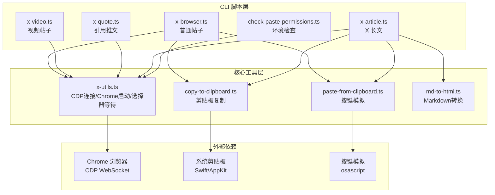

## 用户需求

开发一个通过真实 Chrome 浏览器 + CDP（Chrome DevTools Protocol）来发推的工具，绕过 X 的反自动化检测。

## 产品概述

一个基于 Chrome DevTools Protocol 的 X（Twitter）发帖自动化工具。通过连接真实 Chrome 浏览器实例（非 Puppeteer/Playwright 无头浏览器），利用 CDP 协议操控页面元素，配合系统级剪贴板和按键模拟，绕过 X 平台的反自动化检测机制。工具以 CLI 脚本形式提供，默认仅预览（填充内容到浏览器），用户确认后才实际发布。

## 核心功能

1. **普通帖子（文本 + 图片）**：支持纯文本发帖，可附带最多 4 张图片。通过 CDP 打开 X 编辑器页面，使用 `execCommand('insertText')` 输入文本，通过系统剪贴板 + osascript 真实按键粘贴上传图片。

2. **视频帖子（文本 + 视频）**：支持上传 MP4/MOV/WebM 视频文件发帖。通过 CDP 的 `DOM.setFileInputFiles` 直接设置文件输入，视频上传后自动等待处理完成再允许发布。

3. **引用推文（Quote Tweet）**：打开目标推文页面，通过 CDP 点击转推按钮，选择引用选项，在引用编辑框中输入评论。

4. **X 长文（Article）**：支持将 Markdown 文件转换为 HTML 并发布为 X 长文。包含封面图上传、标题填写、富文本内容粘贴、内嵌图片占位符替换等完整流程。支持 YAML frontmatter 提取标题和封面。

5. **辅助工具**：

- 环境检查脚本：检测 Chrome、Bun 运行时、macOS Accessibility 权限等
- 剪贴板复制工具：通过 Swift/AppKit 将图片和 HTML 内容复制到 macOS 系统剪贴板
- 粘贴按键模拟：通过 osascript 发送真实 Cmd+V 按键（非 CDP 合成事件）
- Markdown 转 HTML 工具：代码高亮、CJK 友好、图片占位符处理

## 技术栈

- **运行时**：Bun（通过 `npx -y bun` 执行 TypeScript）
- **语言**：TypeScript（ESM 模块）
- **浏览器控制**：Chrome DevTools Protocol（原生 WebSocket，无第三方 CDP 库）
- **Markdown 处理**：marked + highlight.js + remark-cjk-friendly + front-matter
- **剪贴板操作**：macOS Swift/AppKit 编译缓存
- **按键模拟**：macOS osascript + System Events

## 实现方案

### 整体策略

完全参考已验证的 `baoyu-post-to-x` 项目架构，在 `x-skill` 目录下重建独立可运行的项目。该参考项目已经过实际验证，能成功绕过 X 的反自动化检测。核心策略包括：

1. **真实浏览器实例**：通过 `--remote-debugging-port` 启动 Chrome，使用 `--disable-blink-features=AutomationControlled` 移除自动化标记
2. **持久化登录**：使用独立的 `--user-data-dir` 保存登录会话，首次需手动登录
3. **系统级粘贴**：图片上传不通过 CDP 合成事件，而是通过系统剪贴板 + osascript 发送真实按键，绕过 X 对合成事件的检测
4. **CDP 原生通信**：自建 WebSocket 连接和消息分发，不依赖 chrome-remote-interface 等第三方库，减少指纹特征

### 关键技术决策

- **不使用 Puppeteer/Playwright**：这些框架会注入 `navigator.webdriver` 等特征，容易被 X 检测。直接使用 CDP WebSocket 通信更隐蔽
- **Swift 编译缓存**：macOS 剪贴板操作需要 Swift/AppKit，首次编译后缓存二进制文件，后续执行无编译开销
- **自由端口分配**：每次启动使用随机可用端口，避免端口冲突。支持复用已有 Chrome 实例（通过 DevToolsActivePort 文件检测）
- **多语言 UI 兼容**：X 界面可能是英文、中文、日文、韩文，所有 CSS 选择器和文本匹配都考虑国际化

## 实现注意事项

- **Chrome 冲突处理**：如果已有 Chrome CDP 实例运行，`waitForChromeDebugPort` 可能连接到错误实例。脚本需能检测并提示 kill 冲突进程
- **图片粘贴验证**：每次粘贴图片后通过轮询 `img[src^="blob:"]` 数量验证是否成功，超时 15 秒
- **视频处理等待**：视频上传后需等待 X 后台处理完成（检测 tweetButton 是否可点击），最长等待 180 秒
- **DraftJS 编辑器兼容**：X 长文使用 DraftJS 编辑器，内容插入使用 ClipboardEvent paste 事件模拟，失败后回退到 `execCommand('insertHTML')`，再失败提示手动粘贴
- **预览模式为默认**：所有脚本默认只填充内容不发布，需要 `--submit` 参数才实际发布，避免误操作

## 架构设计

### 系统架构



### 数据流

1. CLI 解析参数 -> 调用 `launchChromeWithCdp()` 启动 Chrome 并建立 CDP 连接
2. 通过 CDP 的 `Target.getTargets` / `Target.attachToTarget` 获取页面会话
3. 使用 `Runtime.evaluate` 操作 DOM（等待选择器、点击、输入文本）
4. 图片上传：`copy-to-clipboard.ts` 写入系统剪贴板 -> `paste-from-clipboard.ts` 发送真实按键
5. 视频上传：`DOM.setFileInputFiles` 直接设置文件输入
6. 长文内容：`md-to-html.ts` 转换 Markdown -> 通过 ClipboardEvent 粘贴 HTML

### 模块划分

| 模块 | 职责 |
| --- | --- |
| `x-utils.ts` | Chrome 查找/启动、CDP WebSocket 连接封装、选择器等待/点击、端口管理、会话生命周期 |
| `x-browser.ts` | 普通帖子：文本输入 + 图片剪贴板粘贴 |
| `x-video.ts` | 视频帖子：文件输入设置 + 视频处理等待 |
| `x-quote.ts` | 引用推文：打开原推 -> 点击转推 -> 选择引用 -> 输入评论 |
| `x-article.ts` | X 长文：Markdown 解析 -> 封面/标题/内容填充 -> 图片占位替换 |
| `md-to-html.ts` | Markdown 转 HTML：frontmatter 解析、代码高亮、CJK 处理、图片占位 |
| `copy-to-clipboard.ts` | macOS 剪贴板写入（图片/HTML），Swift/AppKit 编译缓存 |
| `paste-from-clipboard.ts` | macOS osascript 真实按键模拟（Cmd+V） |
| `check-paste-permissions.ts` | macOS 环境和 Accessibility 权限检查 |


## 目录结构

```
x-skill/
├── scripts/
│   ├── package.json            # [NEW] 项目依赖配置。声明 front-matter、highlight.js、marked、remark-cjk-friendly、remark-parse、remark-stringify、unified 等依赖，ESM 模块类型。
│   ├── x-utils.ts              # [NEW] 核心工具模块。实现 macOS Chrome 可执行文件查找、CDP WebSocket 连接封装类 CdpConnection（消息收发、事件监听、超时管理）、Chrome 启动与会话管理 launchChromeWithCdp()、选择器等待 cdpWaitForSelector/cdpWaitForAnySelector、元素点击 cdpClickSelector、端口管理、剪贴板/粘贴辅助函数。
│   ├── x-browser.ts            # [NEW] 普通帖子脚本。接收文本和图片参数，启动 Chrome 打开 X 编辑器，等待编辑器加载，通过 execCommand 输入文本，逐张图片通过系统剪贴板粘贴并验证上传。支持 --submit 实际发布。
│   ├── x-video.ts              # [NEW] 视频帖子脚本。接收文本和视频文件参数，通过 DOM.setFileInputFiles 上传视频，等待视频处理完成（轮询 tweetButton 可点击状态），填充文本内容。
│   ├── x-quote.ts              # [NEW] 引用推文脚本。接收推文 URL 和评论参数，打开目标推文，点击转推按钮，从下拉菜单选择引用选项（多语言匹配），在编辑框输入评论。
│   ├── x-article.ts            # [NEW] X 长文脚本。接收 Markdown 文件路径，解析 frontmatter 提取标题/封面，转换 HTML，启动 Chrome 打开 Articles 编辑器，上传封面图、填写标题、粘贴 HTML 内容、按顺序替换图片占位符。
│   ├── md-to-html.ts           # [NEW] Markdown 转 HTML 转换器。解析 YAML frontmatter，使用 marked 渲染 HTML（自定义 renderer：H1 作标题、H2-H6 统一为 h2、代码块转 blockquote），highlight.js 代码高亮，remark-cjk-friendly 处理中日韩文本，图片替换为 XIMGPH_N 占位符，支持远程图片下载。
│   ├── copy-to-clipboard.ts    # [NEW] macOS 剪贴板复制工具。使用 Swift/AppKit 编译缓存（支持图片和 HTML/RTF）。支持 image 和 html 两种模式。
│   ├── paste-from-clipboard.ts # [NEW] macOS 粘贴按键模拟。使用 osascript 发送 Cmd+V（可指定目标 App 激活）。支持重试和延迟配置。
│   └── check-paste-permissions.ts # [NEW] 环境检查脚本。检测 Chrome 安装、Profile 目录隔离、Bun 运行时、macOS Accessibility 权限、剪贴板复制能力、粘贴按键能力、Chrome 实例冲突。
├── references/
│   ├── regular-posts.md        # [NEW] 普通帖子详细指南。包含手动工作流、图片粘贴机制说明、故障排查。
│   └── articles.md             # [NEW] X 长文详细指南。包含 Markdown 格式说明、工作流程、支持的格式映射。
└── SKILL.md                    # [NEW] Skill 入口文档。YAML frontmatter 定义 name 和 description，包含脚本目录说明、环境前置要求、四种功能使用方法、参数说明、故障排查指南。
```

## Agent Extensions

### Skill

- **skill-creator**
- Purpose：在创建 SKILL.md 时参考 skill 最佳实践，确保 SKILL.md 格式规范（YAML frontmatter、name/description 字段、Script Directory 模板、Extension Support 等）
- Expected outcome：生成符合 Claude Code Skill 规范的 SKILL.md 文件，包含正确的 frontmatter、脚本引用、使用说明和故障排查

### SubAgent

- **code-explorer**
- Purpose：在实现过程中如需进一步查看参考项目 `baoyu-post-to-x` 的代码细节，使用此 subagent 进行高效的跨文件搜索
- Expected outcome：获取参考项目中特定实现细节以确保代码一致性