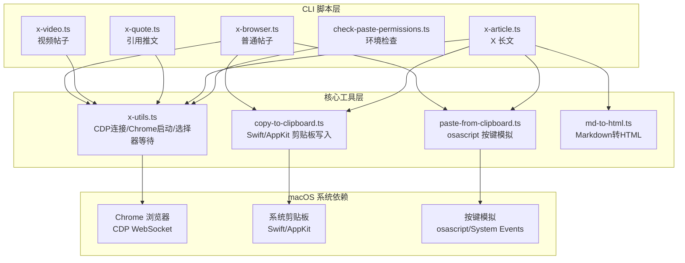

## 用户需求

开发一个通过真实 Chrome 浏览器 + CDP（Chrome DevTools Protocol）来发推的工具，绕过 X 的反自动化检测。仅支持 macOS 平台。

## 产品概述

一个基于 Chrome DevTools Protocol 的 X（Twitter）发帖自动化工具。通过连接真实 Chrome 浏览器实例（非 Puppeteer/Playwright 无头浏览器），利用 CDP 协议操控页面元素，配合 macOS 系统级剪贴板（Swift/AppKit）和按键模拟（osascript），绕过 X 平台的反自动化检测机制。工具以 CLI 脚本形式提供，默认仅预览（填充内容到浏览器），用户确认后才实际发布。

## 核心功能

1. **普通帖子（文本 + 图片）**：支持纯文本发帖，可附带最多 4 张图片。通过 CDP 打开 X 编辑器，使用 `execCommand('insertText')` 输入文本，通过 Swift/AppKit 复制图片到系统剪贴板 + osascript 发送真实 Cmd+V 按键上传图片
2. **视频帖子（文本 + 视频）**：支持上传 MP4/MOV/WebM 视频文件发帖。通过 CDP 的 `DOM.setFileInputFiles` 直接设置文件输入，视频上传后自动等待处理完成再允许发布
3. **引用推文（Quote Tweet）**：打开目标推文页面，通过 CDP 点击转推按钮，选择引用选项，在引用编辑框中输入评论
4. **X 长文（Article）**：支持将 Markdown 文件转换为 HTML 并发布为 X 长文。包含封面图上传、标题填写、富文本内容粘贴、内嵌图片占位符替换等完整流程
5. **辅助工具**：环境检查脚本（Chrome、Bun、macOS Accessibility 权限等）、剪贴板操作工具、粘贴模拟工具、Markdown 转 HTML 工具

## 技术栈

- **运行时**：Bun（通过 `npx -y bun` 执行 TypeScript）
- **语言**：TypeScript（ESM 模块）
- **浏览器控制**：Chrome DevTools Protocol（原生 WebSocket，无第三方 CDP 库）
- **Markdown 处理**：marked + highlight.js + remark-cjk-friendly + front-matter + unified
- **剪贴板操作**：macOS Swift/AppKit 编译缓存（首次编译后缓存二进制，后续无编译开销）
- **按键模拟**：macOS osascript + System Events

## 实现方案

### 整体策略

参考同目录下已验证的 `baoyu-post-to-x` 项目（路径：`/Users/zzzrun/Desktop/tx/src/baoyu-skills/skills/baoyu-post-to-x`），该项目已经过实际验证能成功绕过 X 的反自动化检测。在 `x-skill` 目录下重建独立项目，精简为仅 macOS 平台，去除 Linux/Windows 代码分支。核心策略包括：

1. **真实浏览器实例**：通过 `--remote-debugging-port` 启动 Chrome，使用 `--disable-blink-features=AutomationControlled` 移除自动化标记
2. **持久化登录**：使用独立的 `--user-data-dir`（`~/.local/share/x-browser-profile`）保存登录会话，首次需手动登录
3. **系统级粘贴**：图片上传不通过 CDP 合成事件，而是通过 Swift/AppKit 写入系统剪贴板 + osascript 发送真实 Cmd+V 按键，绕过 X 对合成事件的检测
4. **CDP 原生通信**：自建 WebSocket 连接和消息分发（CdpConnection 类），不依赖 chrome-remote-interface 等第三方库

### 关键技术决策

- **不使用 Puppeteer/Playwright**：这些框架会注入 `navigator.webdriver` 等特征，容易被 X 检测。直接使用 CDP WebSocket 通信更隐蔽
- **Swift 编译缓存**：macOS 剪贴板操作需要 Swift/AppKit，首次编译后缓存二进制文件至 `~/.cache/x-skill/clipboard/`，后续执行无编译开销。通过 MD5 哈希源码判断缓存是否有效
- **自由端口分配**：每次启动使用 `net.createServer` 分配随机可用端口，避免端口冲突。支持复用已有 Chrome 实例（通过 DevToolsActivePort 文件检测）
- **仅 macOS**：所有平台分支代码精简为仅 darwin，去除 Linux（xdotool/ydotool/wl-copy/xclip）和 Windows（PowerShell/SendKeys）相关代码

## 实现注意事项

- **Chrome 冲突处理**：如果已有 Chrome CDP 实例运行，`waitForChromeDebugPort` 可能连接到错误实例。脚本需检测并提示 `pkill -f "Chrome.*remote-debugging-port"` 清理冲突进程
- **图片粘贴验证**：每次粘贴图片后通过轮询 `img[src^="blob:"]` 数量验证是否成功，超时 15 秒
- **视频处理等待**：视频上传后需等待 X 后台处理完成（检测 tweetButton 是否可点击），最长等待 180 秒
- **DraftJS 编辑器兼容**：X 长文使用 DraftJS 编辑器，内容插入优先使用 ClipboardEvent paste 事件模拟，失败回退到 `execCommand('insertHTML')`，最后提示手动粘贴
- **预览模式为默认**：所有脚本默认只填充内容不发布，需要 `--submit` 参数才实际发布，避免误操作
- **缓存路径**：Swift 二进制缓存使用 `~/.cache/x-skill/clipboard/` 而非原项目的 `~/.cache/baoyu-skills/clipboard/`，保持项目独立

## 架构设计

### 系统架构



### 数据流

1. CLI 解析参数 -> 调用 `launchChromeWithCdp()` 启动 Chrome 并建立 CDP 连接
2. 通过 CDP 的 `Target.getTargets` / `Target.attachToTarget` 获取页面会话
3. 使用 `Runtime.evaluate` 操作 DOM（等待选择器、点击、输入文本）
4. 图片上传：`copy-to-clipboard.ts` 通过 Swift/AppKit 写入系统剪贴板 -> `paste-from-clipboard.ts` 通过 osascript 发送真实 Cmd+V 按键
5. 视频上传：`DOM.setFileInputFiles` 直接设置文件输入
6. 长文内容：`md-to-html.ts` 转换 Markdown -> 通过 ClipboardEvent 粘贴 HTML

### 模块划分

| 模块 | 职责 |
| --- | --- |
| `x-utils.ts` | macOS Chrome 查找/启动、CDP WebSocket 连接封装（CdpConnection 类）、选择器等待/点击、端口管理、会话生命周期、剪贴板/粘贴辅助函数 |
| `x-browser.ts` | 普通帖子：文本输入 + 图片剪贴板粘贴 + 上传验证 |
| `x-video.ts` | 视频帖子：DOM.setFileInputFiles 文件输入 + 视频处理等待 |
| `x-quote.ts` | 引用推文：打开原推 -> 点击转推 -> 选择引用 -> 输入评论 |
| `x-article.ts` | X 长文：Markdown 解析 -> 封面/标题/内容填充 -> 图片占位替换 |
| `md-to-html.ts` | Markdown 转 HTML：frontmatter 解析、代码高亮、CJK 处理、图片占位 |
| `copy-to-clipboard.ts` | macOS 剪贴板写入（Swift/AppKit 编译缓存，支持图片和 HTML/RTF） |
| `paste-from-clipboard.ts` | macOS osascript 真实按键模拟（Cmd+V，支持指定目标 App） |
| `check-paste-permissions.ts` | macOS 环境和 Accessibility 权限检查 |


## 目录结构

```
x-skill/
├── scripts/
│   ├── package.json            # [NEW] 项目依赖配置。ESM 模块类型，声明 front-matter、highlight.js、marked、remark-cjk-friendly、remark-parse、remark-stringify、unified 依赖。
│   ├── x-utils.ts              # [NEW] 核心工具模块。实现 macOS Chrome 路径查找（/Applications/ 下的 Chrome/Canary/Beta/Chromium/Edge 候选）、CdpConnection 类（WebSocket 消息收发、事件监听、超时管理）、launchChromeWithCdp()（Chrome 启动+CDP 连接+页面会话管理）、cdpWaitForSelector/cdpWaitForAnySelector/cdpClickSelector、getFreePort、sleep、copyImageToClipboard/copyHtmlToClipboard/pasteFromClipboard 辅助函数。仅保留 macOS 平台逻辑，去除 Chrome 启动的 useMacOsOpen 中对 process.platform 的分支判断。
│   ├── x-browser.ts            # [NEW] 普通帖子脚本。CLI 接收文本和 --image 参数（可重复，最多 4 张），启动 Chrome 打开 x.com/compose/post，等待编辑器 [data-testid="tweetTextarea_0"] 加载（未登录时等待登录），通过 execCommand('insertText') 输入文本，逐张图片通过系统剪贴板粘贴并轮询 img[src^="blob:"] 验证上传。支持 --submit 实际发布、--profile 自定义 profile。
│   ├── x-video.ts              # [NEW] 视频帖子脚本。CLI 接收文本和 --video 参数，通过 DOM.getDocument + DOM.querySelector 查找 input[type="file"]，使用 DOM.setFileInputFiles 上传视频，等待视频处理完成（轮询 tweetButton 可点击状态，最长 180 秒），填充文本内容。支持 --submit 和 --profile。
│   ├── x-quote.ts              # [NEW] 引用推文脚本。CLI 接收推文 URL 和评论文本，打开目标推文页面，等待 [data-testid="retweet"] 按钮加载，点击后在下拉菜单中通过文本匹配（quote/引用/引用ポスト/인용）选择引用选项，在编辑框使用 Input.insertText 输入评论。支持 --submit 和 --profile。
│   ├── x-article.ts            # [NEW] X 长文脚本。CLI 接收 Markdown 文件路径，调用 md-to-html.ts 的 parseMarkdown() 解析 frontmatter 提取标题/封面并转换 HTML，启动 Chrome 打开 x.com/compose/articles，点击 Write 按钮进入编辑器，上传封面图（DOM.setFileInputFiles + Apply 按钮点击），Input.insertText 填写标题，通过 ClipboardEvent paste 粘贴 HTML 内容（失败回退 execCommand），按 XIMGPH_N 顺序替换图片占位符（选择->删除->粘贴图片）。支持 --cover/--title/--submit。
│   ├── md-to-html.ts           # [NEW] Markdown 转 HTML 转换器。使用 front-matter 解析 YAML frontmatter（title/cover_image 等），marked 自定义 renderer（H1 作标题不输出、H2-H6 统一为 h2、代码块转 blockquote 带语法高亮），highlight.js 代码高亮，unified+remark-parse+remark-cjk-friendly 预处理 CJK 文本，图片替换为 XIMGPH_N 占位符，支持远程图片下载缓存。导出 parseMarkdown() 函数。
│   ├── copy-to-clipboard.ts    # [NEW] macOS 剪贴板复制工具。内嵌 Swift/AppKit 源码字符串，首次调用时编译为二进制并缓存至 ~/.cache/x-skill/clipboard/（MD5 哈希命名），支持 image 模式（NSImage 写入剪贴板）和 html 模式（HTML+RTF+纯文本三种格式同时写入）。CLI 支持 `image <path>` 和 `html [--file <path>] [text]` 两种用法。
│   ├── paste-from-clipboard.ts # [NEW] macOS 粘贴按键模拟。使用 osascript 发送 Cmd+V 按键（可选先通过 `tell application` 激活目标 App），支持 --retries（重试次数）、--delay（重试间隔）、--app（目标应用名如 "Google Chrome"）。使用 Atomics.wait 实现同步 sleep。
│   └── check-paste-permissions.ts # [NEW] macOS 环境检查脚本。依次检测：Chrome 安装路径、Profile 目录隔离状态、Bun 运行时、Accessibility 权限（osascript 查询 System Events）、剪贴板复制能力（编译 Swift 测试脚本）、粘贴按键能力、Chrome 实例冲突（pgrep 检测）。以表情符号格式输出结果。
├── references/
│   ├── regular-posts.md        # [NEW] 普通帖子详细指南。包含手动工作流步骤、图片粘贴机制说明（为什么不能用 CDP 合成事件）、Image Support 格式说明、示例会话、故障排查（Chrome not found / Not logged in / Image paste fails / osascript permission denied）。
│   └── articles.md             # [NEW] X 长文详细指南。包含 Prerequisites（X Premium）、Markdown 格式规范（frontmatter fields）、Image Handling 流程（Cover/Remote/Placeholders/Insertion）、Supported Formatting 映射表、完整 Workflow 步骤、示例会话、故障排查。
└── SKILL.md                    # [NEW] Skill 入口文档。YAML frontmatter（name: x-skill, description: 第三人称描述功能和触发词）。包含 Script Directory 表格、Preferences（EXTEND.md）部分、Prerequisites、Pre-flight Check、References 链接、四种功能（Regular Posts/Video Posts/Quote Tweets/X Articles）的参数表和使用示例、Troubleshooting、Extension Support。参考 baoyu-post-to-x 的 SKILL.md 格式。
```

## Agent Extensions

### Skill

- **skill-creator**
- Purpose：在创建 SKILL.md 时参考 skill 创建最佳实践，确保 SKILL.md 格式规范（YAML frontmatter、name/description 字段、Script Directory 模板、Extension Support 等）
- Expected outcome：生成符合 Skill 规范的 SKILL.md 文件，包含正确的 frontmatter、脚本引用、使用说明和故障排查

### SubAgent

- **code-explorer**
- Purpose：在实现过程中查看参考项目 `baoyu-post-to-x`（`/Users/zzzrun/Desktop/tx/src/baoyu-skills/skills/baoyu-post-to-x/`）的代码细节
- Expected outcome：获取参考项目中特定实现细节以确保代码一致性和功能完整性