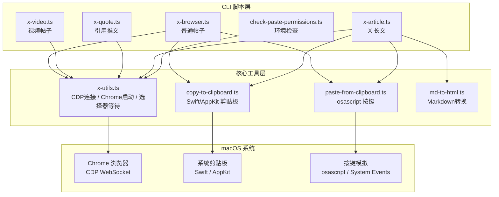

## 用户需求

开发一个通过真实 Chrome 浏览器 + CDP（Chrome DevTools Protocol）发推的工具，绕过 X 平台的反自动化检测。

## 产品概述

一个仅面向 macOS 的 X（Twitter）发帖自动化工具。通过连接真实 Chrome 浏览器实例，利用 CDP 协议操控页面元素，配合 macOS 原生剪贴板（Swift/AppKit）和 osascript 真实按键模拟，绕过 X 平台反自动化检测。工具以独立 CLI 脚本形式提供，默认仅预览（填充内容到浏览器），用户确认后才实际发布。

## 核心功能

1. **普通帖子（文本 + 图片）**：支持纯文本发帖，可附带最多 4 张图片。通过 CDP 打开 X 编辑器，使用 `execCommand('insertText')` 输入文本，通过 Swift/AppKit 写入系统剪贴板 + osascript 发送真实 Cmd+V 粘贴上传图片。

2. **视频帖子（文本 + 视频）**：支持上传 MP4/MOV/WebM 视频文件。通过 CDP 的 `DOM.setFileInputFiles` 直接设置文件输入，轮询等待视频处理完成（最长 180 秒）。

3. **引用推文（Quote Tweet）**：打开目标推文页面，CDP 点击转推按钮，选择引用选项（多语言菜单匹配），在编辑框输入评论。

4. **X 长文（Article）**：将 Markdown 转换为 HTML 并发布为 X 长文。包含封面图上传、标题填写、DraftJS 编辑器富文本粘贴、内嵌图片占位符替换。支持 YAML frontmatter 提取标题和封面。

5. **辅助工具**：环境权限检查、macOS 系统剪贴板复制（Swift/AppKit）、osascript 真实按键模拟、Markdown 转 HTML 转换器。

## 技术栈

- **运行时**：Bun（通过 `npx -y bun` 执行 TypeScript）
- **语言**：TypeScript（ESM 模块）
- **浏览器控制**：Chrome DevTools Protocol（原生 WebSocket，不使用第三方 CDP 库）
- **Markdown 处理**：marked + highlight.js + remark-cjk-friendly + front-matter
- **剪贴板操作**：Swift/AppKit 编译缓存（macOS 专用）
- **按键模拟**：osascript + System Events（macOS 专用）
- **平台**：仅 macOS

## 实现方案

### 整体策略

从零构建一个独立可运行的 CLI 工具集，核心思路是通过真实 Chrome 浏览器 + CDP 原生 WebSocket 通信来操控 X 页面，配合 macOS 系统级别的剪贴板和按键模拟，让所有操作对 X 的反自动化检测系统而言都像真实用户操作。

### 关键技术决策

1. **不使用 Puppeteer/Playwright**：这些框架会注入 `navigator.webdriver` 等特征被 X 检测。直接使用 CDP WebSocket 通信更隐蔽
2. **真实浏览器实例**：通过 `--remote-debugging-port` 启动 Chrome，使用 `--disable-blink-features=AutomationControlled` 移除自动化标记
3. **持久化登录**：使用独立 `--user-data-dir`（`~/.local/share/x-browser-profile`）保存会话，首次需手动登录
4. **系统级粘贴**：图片上传不通过 CDP 合成事件（X 会检测并忽略），而是通过 Swift/AppKit 写入系统剪贴板 + osascript 发送真实 Cmd+V 按键
5. **Swift 编译缓存**：剪贴板操作需 Swift/AppKit，首次编译后缓存二进制到 `~/.cache/x-skill/clipboard/`，后续无编译开销
6. **健壮的 Chrome 生命周期管理**：重点解决旧项目 "Chrome debug port not ready" 的问题：

- 启动前检测已有 Chrome CDP 实例（通过 `DevToolsActivePort` 文件 + HTTP 健康检查）
- 支持复用已有实例或自动启动新实例
- 使用 `open -na` 方式启动（macOS 原生方式，更可靠）
- 端口等待采用指数退避 + 更长超时 + 详细错误信息
- 连接失败时给出明确的诊断提示（kill 冲突进程命令）

7. **自由端口分配**：使用 `net.createServer` 获取随机可用端口，避免端口冲突

### 核心类设计

- **`CdpConnection`**：原生 WebSocket CDP 连接封装，消息 ID 自增、Promise 异步响应、事件订阅、超时管理、连接关闭清理
- **`launchChromeWithCdp()`**：Chrome 启动 + CDP 连接一体化管理函数，返回 `{ cdp, sessionId, cleanup }` 供各脚本使用
- **选择器工具函数**：`cdpWaitForSelector`（轮询等待元素出现）、`cdpWaitForAnySelector`（多选择器任意匹配）、`cdpClickSelector`（点击元素）

## 实现注意事项

- **Chrome 冲突处理**：如已有 Chrome CDP 实例，尝试复用；无法复用时给出 `pkill -f "Chrome.*remote-debugging-port"` 提示
- **图片粘贴验证**：每次粘贴后轮询 `img[src^="blob:"]` 数量验证成功，超时 15 秒
- **视频处理等待**：检测 tweetButton 可点击状态，最长 180 秒
- **DraftJS 编辑器兼容**：长文内容插入依次尝试 ClipboardEvent paste -> execCommand('insertHTML') -> 提示手动粘贴
- **预览模式为默认**：所有脚本默认只填充不发布，`--submit` 参数才实际发布
- **仅 macOS**：所有代码路径只考虑 macOS（Chrome 路径、Swift/AppKit、osascript），不包含 Linux/Windows 分支

## 架构设计

### 系统架构



### 数据流

1. CLI 解析参数 → `launchChromeWithCdp()` 启动 Chrome 并建立 CDP WebSocket 连接
2. `Target.getTargets` / `Target.attachToTarget` 获取页面会话
3. `Runtime.evaluate` 操作 DOM（等待选择器、点击、输入文本）
4. 图片上传：`copy-to-clipboard.ts` 通过 Swift 写入系统剪贴板 → `paste-from-clipboard.ts` osascript 发送真实 Cmd+V
5. 视频上传：`DOM.setFileInputFiles` 直接设置文件输入
6. 长文内容：`md-to-html.ts` 转 Markdown → 通过 ClipboardEvent 粘贴 HTML 到 DraftJS 编辑器

### 模块划分

| 模块 | 职责 |
| --- | --- |
| `x-utils.ts` | Chrome 查找/启动（macOS 路径）、CDP WebSocket 连接封装、选择器等待/点击、端口管理、会话生命周期 |
| `x-browser.ts` | 普通帖子：文本输入 + 图片剪贴板粘贴 + 上传验证 |
| `x-video.ts` | 视频帖子：文件输入设置 + 视频处理等待 |
| `x-quote.ts` | 引用推文：打开原推 → 点击转推 → 选择引用 → 输入评论 |
| `x-article.ts` | X 长文：Markdown 解析 → 封面/标题/内容填充 → 图片占位替换 |
| `md-to-html.ts` | Markdown 转 HTML：frontmatter 解析、代码高亮、CJK 处理、图片占位符 |
| `copy-to-clipboard.ts` | macOS 剪贴板写入（图片/HTML），Swift 编译缓存 |
| `paste-from-clipboard.ts` | macOS osascript 真实 Cmd+V 按键模拟 |
| `check-paste-permissions.ts` | macOS 环境检查：Chrome、Bun、Accessibility 权限、剪贴板能力 |


## 目录结构

```
x-skill/
├── scripts/
│   ├── package.json              # [NEW] 项目依赖配置。声明 front-matter、highlight.js、marked、remark-cjk-friendly、remark-parse、remark-stringify、unified 等依赖。ESM 模块类型，private 项目。
│   ├── x-utils.ts                # [NEW] 核心工具模块。实现：(1) macOS Chrome 可执行文件查找（/Applications 路径候选列表）；(2) CdpConnection 类（原生 WebSocket、消息 ID 自增、Promise 响应、事件监听、超时管理）；(3) launchChromeWithCdp() 一体化启动函数（端口分配、Chrome 启动、CDP 连接、会话附着、域启用）；(4) cdpWaitForSelector / cdpWaitForAnySelector / cdpClickSelector 选择器工具；(5) copyImageToClipboard / copyHtmlToClipboard / pasteFromClipboard 辅助函数（调用同目录脚本）；(6) 端口管理和 DevToolsActivePort 复用检测。
│   ├── x-browser.ts              # [NEW] 普通帖子脚本。CLI 接收 text + --image + --submit + --profile 参数。启动 Chrome 打开 x.com/compose/post，等待编辑器加载（支持等待登录），execCommand('insertText') 输入文本，逐张图片通过系统剪贴板粘贴并验证 blob: img 数量，--submit 时点击 tweetButton。
│   ├── x-video.ts                # [NEW] 视频帖子脚本。CLI 接收 text + --video + --submit 参数。通过 DOM.setFileInputFiles 上传视频文件，轮询 tweetButton 可点击状态等待处理完成（最长 180s），填充文本内容。
│   ├── x-quote.ts                # [NEW] 引用推文脚本。CLI 接收 tweet-url + comment + --submit 参数。打开目标推文页面，等待 retweet 按钮加载，点击后从 Dropdown 菜单匹配 Quote 选项（支持英/中/日/韩多语言），在编辑框输入评论。
│   ├── x-article.ts              # [NEW] X 长文发布脚本。CLI 接收 markdown + --cover + --title + --submit 参数。调用 md-to-html 解析 Markdown，启动 Chrome 打开 x.com/compose/articles，上传封面图（DOM.setFileInputFiles + Apply 按钮），填写标题（Input.insertText），粘贴 HTML 内容（ClipboardEvent → execCommand → 手动粘贴三级降级），按序替换 XIMGPH 图片占位符。
│   ├── md-to-html.ts             # [NEW] Markdown 转 HTML 转换器。解析 YAML frontmatter 提取标题/封面，使用 marked 渲染 HTML（自定义 renderer：H1 作标题、H2-H6 统一为 h2、代码块转 blockquote），highlight.js 代码高亮，remark-cjk-friendly 处理中日韩文本，图片替换为 XIMGPH_N 占位符，支持远程图片下载。
│   ├── copy-to-clipboard.ts      # [NEW] macOS 剪贴板复制工具。内嵌 Swift/AppKit 源码，支持 image（NSImage 写入剪贴板）和 html（HTML + RTF + plaintext 多格式写入）两种模式。Swift 二进制按源码 MD5 哈希缓存到 ~/.cache/x-skill/clipboard/，首次编译后复用。
│   ├── paste-from-clipboard.ts   # [NEW] macOS 粘贴按键模拟。使用 osascript 发送真实 Cmd+V：先 activate 目标 App（默认 Google Chrome），再通过 System Events 发送 keystroke "v" using command down。支持 --retries / --delay / --app 参数，失败自动重试。
│   └── check-paste-permissions.ts # [NEW] macOS 环境检查脚本。逐项检测：Chrome 安装、Profile 目录隔离、Bun 运行时、macOS Accessibility 权限（osascript System Events）、Swift 剪贴板能力、osascript 按键能力、已有 Chrome 实例冲突。
├── references/
│   ├── regular-posts.md          # [NEW] 普通帖子详细指南。包含手动工作流（copy-to-clipboard → paste-from-clipboard）、图片粘贴机制说明（CDP 合成事件 vs 真实按键）、故障排查。
│   └── articles.md               # [NEW] X 长文详细指南。包含 Markdown 格式说明、frontmatter 字段、工作流程、支持的格式映射表、图片占位符机制、故障排查。
└── SKILL.md                      # [NEW] Skill 入口文档。YAML frontmatter 定义 name 和 description，包含脚本目录说明、Agent 执行指令、环境前置要求、四种功能使用方法和参数表、故障排查（含 Chrome 端口冲突自动处理）、EXTEND.md 偏好支持。
```

## Agent Extensions

### Skill

- **skill-creator**
- Purpose：在创建 SKILL.md 时参考 skill 最佳实践，确保格式规范（YAML frontmatter、name/description 字段、Script Directory 模板、Extension Support 等）
- Expected outcome：生成符合 Skill 规范的 SKILL.md 文件，包含正确的 frontmatter、脚本引用、使用说明和故障排查

### SubAgent

- **code-explorer**
- Purpose：在实现各脚本时如需验证 X 页面的 DOM 结构或 CDP 协议用法细节，使用此 subagent 进行高效的代码搜索
- Expected outcome：快速定位相关代码模式以确保实现正确性